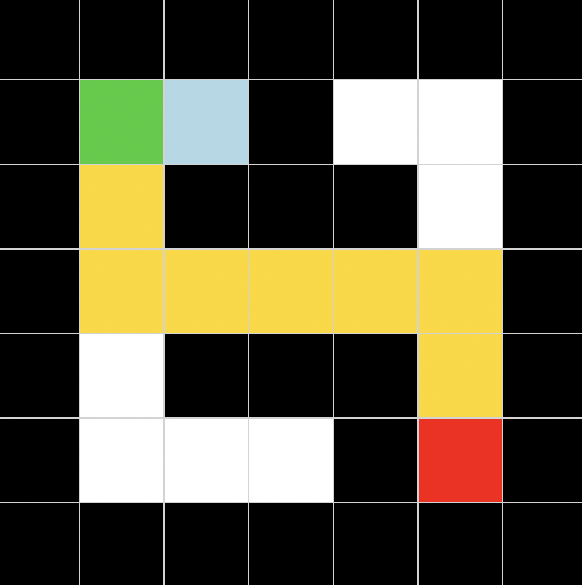
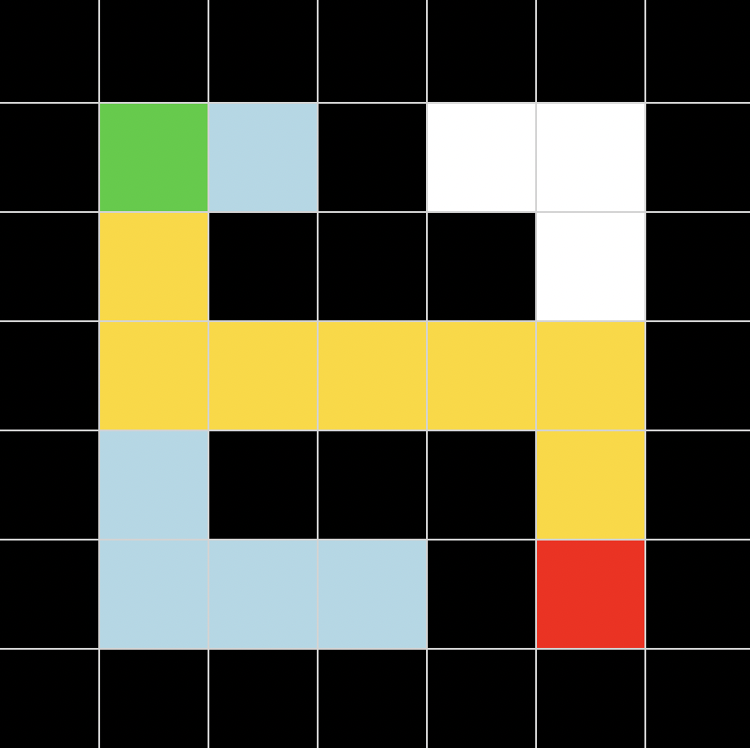

# 🧠 Maze Solver with BFS, DFS, Greedy & A* (AI Search Visualization)

This project implements multiple search algorithms used in Artificial Intelligence to solve a maze and visually demonstrates how each algorithm explores the search space step by step.

---

## 📌 Overview

The goal is to find a path from a **start position (S)** to a **goal position (G)** in a grid-based maze while avoiding obstacles.

This project compares:

- **Uninformed search algorithms** (BFS, DFS)
- **Informed search algorithms** (Greedy, A*)

It provides a **real-time visualization**, making it easy to understand how each algorithm behaves.

---

## 🧩 Problem Representation

- **State**: `(row, column)`
- **Actions**: up, down, left, right
- **Obstacles**: represented by `#`
- **Start**: `S`
- **Goal**: `G`

---

## 🚀 Algorithms

🔵 **Breadth-First Search (BFS)**
- Explores nodes level by level
- Uses a queue (FIFO)
- Guarantees the shortest path
- Explores many nodes (high memory usage)

🟣 **Depth-First Search (DFS)**
- Explores as deep as possible first
- Uses a stack (LIFO)
- Does not guarantee shortest path
- Can be faster but unreliable

🟢 **Greedy Best-First Search**
- Uses a heuristic (Manhattan distance)
- Chooses nodes closest to the goal
- Faster in many cases
- Does NOT guarantee optimal solution

🟡 **A* Search**
- Combines:
  - `g(n)` → cost so far
  - `h(n)` → estimated cost to goal
- Uses: `f(n) = g(n) + h(n)`
- Guarantees optimal path (if heuristic is admissible)
- Most efficient and reliable algorithm in this project

---

## 🎨 Visualization

The GUI provides a visual representation of the search:

- 🟩 **Green** → Start node  
- 🟥 **Red** → Goal node  
- ⬛ **Black** → Walls  
- ⬜ **White** → Free space  
- 🔵 **Light Blue** → Explored nodes  
- 🟡 **Gold** → Final path  

---

## 🖼️ Algorithm Visualizations

### 🔵 BFS


### 🟣 DFS


### 🟢 Greedy


### 🟡 A*


---

## 🎬 How it works

1. The maze is loaded from a `.txt` file  
2. You choose an algorithm:
   - BFS
   - DFS
   - Greedy
   - A*
3. The algorithm explores the maze step by step  
4. The process is animated in real time  
5. When the goal is reached:
   - The path is highlighted  
   - Statistics are displayed  

---

## 📊 Output Information

- **Algorithm used**
- **Path length**
- **Number of explored states**

---

## 🖥️ Example

### Input maze:
```
#######
#S #  #
# ### #
#     #
# ### #
#   #G#
#######
```
### Output (visual):
- Animated exploration  
- Highlighted optimal path  

---

## ▶️ How to Run

```bash
cd maze
python gui.py
```
---

## 📁 Project Structure

```bash
maze/
├── maze.py          # BFS, DFS, Greedy, A* logic
├── gui.py           # Tkinter GUI visualization
├── maze.txt         # Input maze
├── screenshot.png   # BFS preview
├── dfs.png          # DFS preview
├── greedy.png       # Greedy preview
├── astar.png        # A* preview
└── README.md        # Project documentation
```
---

## 💡 Key Concepts

- Graph traversal
- State-space search
- Uninformed vs informed search
- Heuristic functions
- Path reconstruction
- Visualization of AI algorithms

---

## 👩🏻‍💻 Author

Developed as part of learning Artificial Intelligence fundamentals and search algorithms.