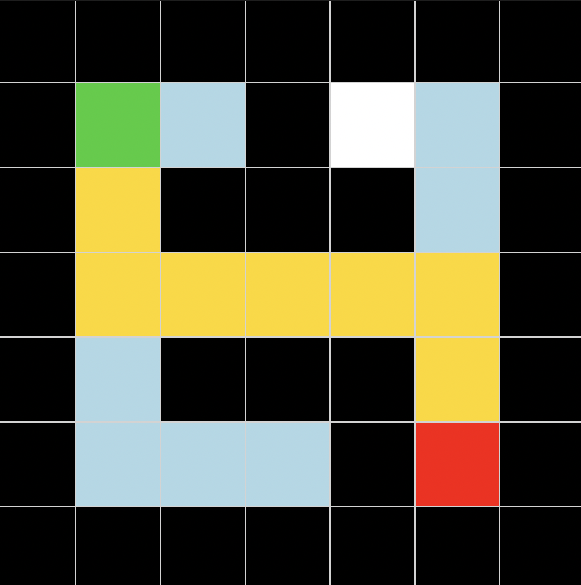

# 🧠 Maze Solver with BFS (AI Search Visualization)

This project implements a **Breadth-First Search (BFS)** algorithm to solve a maze and visually demonstrates how the search process works step by step.

---

## 📌 Overview

The goal is to find the shortest path from a **start position (S)** to a **goal position (G)** in a grid-based maze while avoiding obstacles.

Unlike a simple solver, this project also **visualizes the exploration process**, making it easier to understand how BFS works internally.

---

## 🧩 Problem Representation

- **State**: `(row, column)`
- **Actions**: up, down, left, right
- **Obstacles**: represented by `#`
- **Start**: `S`
- **Goal**: `G`

---

## 🚀 Algorithm

The project uses **Breadth-First Search (BFS)**:

- Explores nodes **level by level**
- Guarantees the **shortest path**
- Uses a **queue (FIFO)** structure
- Tracks visited states to avoid cycles

---

## 🎨 Visualization

The GUI provides a visual representation of the search:

- 🟩 **Green** → Start node  
- 🟥 **Red** → Goal node  
- ⬛ **Black** → Walls  
- ⬜ **White** → Free space  
- 🔵 **Light Blue** → Explored nodes (BFS traversal)  
- 🟡 **Gold** → Final shortest path  



---

## 🎬 How it works

1. The maze is loaded from a `.txt` file  
2. BFS explores the grid step by step  
3. Each explored state is animated in real time  
4. Once the goal is reached:
   - The shortest path is highlighted  
   - Statistics are displayed  

---

## 📊 Output Information

- **Path length**
- **Number of explored states**

---

## 🖥️ Example

### Input maze:
```
#######
#S #  #
# ### #
#     #
# ### #
#   #G#
#######
```
### Output (visual):
- Animated exploration  
- Highlighted optimal path  

---

## ▶️ How to Run

```bash
cd maze
python gui.py
```
---

## 📁 Project Structure

```bash
maze/
├── maze.py          # BFS logic (maze solver)
├── gui.py           # Tkinter GUI visualization
├── maze.txt         # Input maze
├── screenshot.png   # GUI preview
└── README.md        # Project documentation 
```
---

## 💡 Key Concepts

- Graph traversal
- State-space search
- BFS vs DFS
- Path reconstruction
- Visualization of AI algorithms

---

## 🔥 Future Improvements

- Add DFS / A* comparison
- Allow custom maze input
- Generate random mazes
- Adjustable animation speed

---

## 👩🏻‍💻 Author

Developed as part of learning Artificial Intelligence fundamentals and search algorithms.
