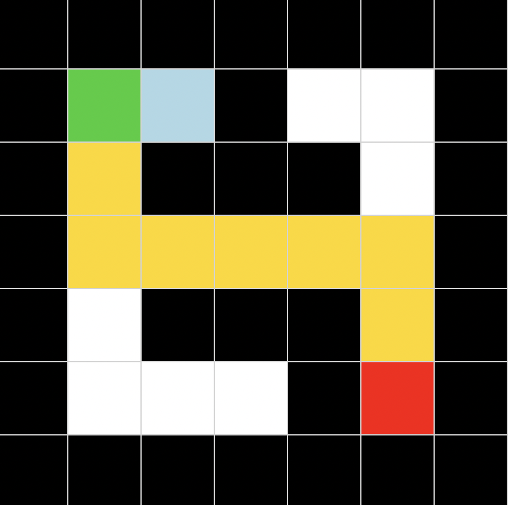

# 🧠 Maze Solver with BFS & DFS (AI Search Visualization)

This project implements **Breadth-First Search (BFS)** and **Depth-First Search (DFS)** algorithms to solve a maze and visually demonstrates how the search process works step by step.

---

## 📌 Overview

The goal is to find a path from a **start position (S)** to a **goal position (G)** in a grid-based maze while avoiding obstacles.

BFS guarantees the shortest path, while DFS may return a longer path depending on exploration order.

The project provides a **step-by-step visualization** of the search process, allowing you to clearly see the difference between BFS and DFS.

---

## 🧩 Problem Representation

- **State**: `(row, column)`
- **Actions**: up, down, left, right
- **Obstacles**: represented by `#`
- **Start**: `S`
- **Goal**: `G`

---

## 🚀 Algorithms

🔵 **Breadth-First Search (BFS)**
	- Explores nodes level by level
	- Uses a queue (FIFO)
	- Guarantees the shortest path
	- More memory-intensive

🟣 **Depth-First Search (DFS)**
	- Explores as deep as possible first
	- Uses a stack (LIFO)
	- Does not guarantee shortest path
	- Can be faster in some cases but less reliable

---

## 🎨 Visualization

The GUI provides a visual representation of the search:

- 🟩 **Green** → Start node  
- 🟥 **Red** → Goal node  
- ⬛ **Black** → Walls  
- ⬜ **White** → Free space  
- 🔵 **Light Blue** → Explored nodes (BFS / DFS traversal)  
- 🟡 **Gold** → Final shortest path  

### 🔵 BFS


### 🟣 DFS


---

## 🎬 How it works

1.	The maze is loaded from a `.txt` file
2.	You choose:
	- Solve with BFS
	- Solve with DFS
3.	The algorithm explores the maze step by step
4.	The process is animated in real time
5.	When the goal is reached:
	- The path is highlighted
	- Statistics are displayed
 

---

## 📊 Output Information

- **Algorithm used (BFS / DFS)**
- **Path length**
- **Number of explored states**

---

## 🖥️ Example

### Input maze:
```
#######
#S #  #
# ### #
#     #
# ### #
#   #G#
#######
```
### Output (visual):
- Animated exploration  
- Highlighted optimal path  

---

## ▶️ How to Run

```bash
cd maze
python gui.py
```
---

## 📁 Project Structure

```bash
maze/
├── maze.py          # BFS & DFS logic
├── gui.py           # Tkinter GUI visualization
├── maze.txt         # Input maze
├── screenshot.png   # BFS GUI preview
├── dfs.png          # DFS GUI preview
└── README.md        # Project documentation
```
---

## 💡 Key Concepts

- Graph traversal
- State-space search
- BFS vs DFS comparison
- Path reconstruction
- Visualization of AI algorithms

---

## 🔥 Future Improvements

- Add A* and Greedy Search
- Allow custom maze input
- Generate random mazes
- Adjustable animation speed
- Different colors for BFS and DFS exploration

---

## 👩🏻‍💻 Author

Developed as part of learning Artificial Intelligence fundamentals and search algorithms.
